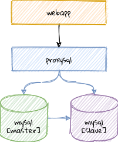

# NWSE DevOps Assignment

The task for this assignment is to automate the provisioning of a simple webapp including it's dependencies as shown in the following diagram:

You do not need to provision this on real hosts. A working local development environment based on [molecule](https://molecule.readthedocs.io/en/latest/) and docker is sufficient.

## Info

- the roles should reside in the top-level directory `roles` inside this project
- there are already some skeleton roles added to this repository that were generated using [molecule](https://molecule.readthedocs.io/en/latest/)
- you can decide if you want to continue to use the defined skeleton roles (you can adapt them and/or re-use existing roles that you find on Galaxy or from other playbooks)
- please specify all requirements, be it Ansible modules or Python dependencies accordingly so that the playbook can be run on any host
- if you copy publicly available code from external modules, playbooks or roles please link the source
- the `requirements.txt` file already contains all dependencies required for creating a virutalenv to run ansible

Time to invest: ~4h

## Requirements

1. Create a MySQL user called `webapp` and grant it all permissions. You do **not** need to setup replication and you do **not** need to tune the config.
1. Adapt the `proxysql.cnf.j2` file specifying hostnames, users and passwords and render the template to `/etc/proxysql.cnf`.
1. The webapp container only needs Apache httpd installed and a config file in .env format at `/etc/default/webapp` that contains variables `DB_HOST`, `DB_PORT`, `DB_USER` and `DB_PASSWORD`
1. Imagine that this playbook is used for several deployments of the same webapp (cluster 1, cluster 2, etc.). How do you need to organize the variables and the inventory? (please provide an example inventory)
1. The Playbook should support both CentOS 8 and Ubuntu 20.04. Please provide molecule tests using the docker driver for each role and one for the cluster. We expect a successful converge. You do not need to provide extensive tests.

## Content of Assignment Interview

- be prepared to walk us through your code
- possible questions related to this setup:
  - What would you like to improve first considering you have more time?
  - How would you automate a MySQL update (minor version)?
  - How to scale the webapp?
  - What tests do you consider necessary for this webapp and it's dependencies?
  - Troubleshooting questions
